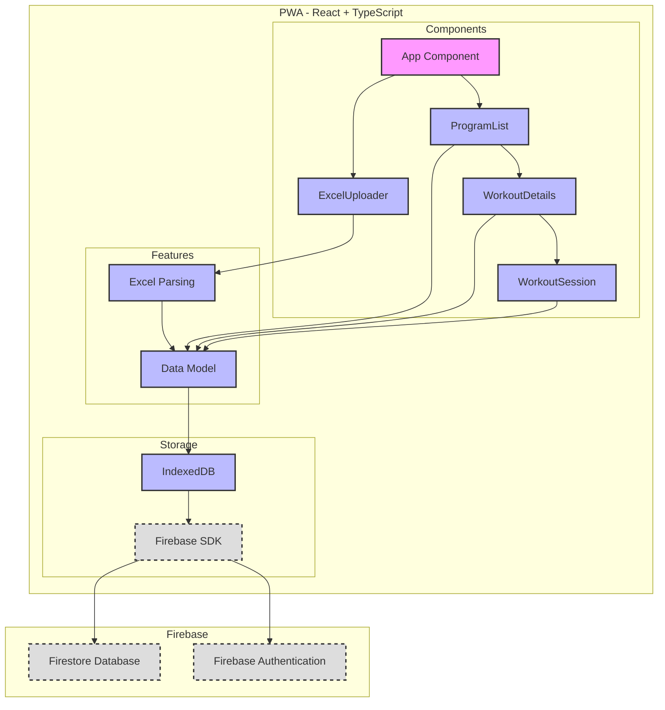

# System Patterns: Excel Workout PWA

## System Architecture

This application follows a client-server architecture, with the PWA acting as the client and Firebase Firestore acting as the server. The client handles the user interface, Excel file parsing, and offline data storage, while the server handles data persistence, synchronization, and (optionally) authentication.

## Technologies Used

* **Frontend:**
  * **React:** JavaScript library for building user interfaces.
    * Functional components with hooks
    * CSS Modules for component-scoped styling
    * React Testing Library for component testing
  * **TypeScript:** Superset of JavaScript that adds static typing.
    * Strict type checking enabled
    * Custom type declarations for CSS modules
    * Comprehensive interfaces for data models
  * **IndexedDB:** Browser-based NoSQL database for offline storage.
    * Structured workout program storage
    * Async/await wrapper functions
    * Error handling and type safety
  * **`idb` library:** A small wrapper around IndexedDB for easier use.
  * **`xlsx` library:** For parsing Excel files.
    * Dynamic header mapping
    * Type-safe data extraction
    * Error handling for invalid files
  * **`uuid` library:** For generating unique identifiers.
  * **`react-router-dom`:** For client-side routing.
  * **Service Worker API:** For enabling PWA features (offline support, background sync).
* **Backend:**
  * **Firebase Firestore:** NoSQL, real-time database for data storage and synchronization.
  * **Firebase Authentication (Optional):** For user authentication.

## Key Technical Decisions

* **Offline-First:** The application is designed to work offline, using IndexedDB for local data storage. Data is synchronized with Firestore when a network connection is available.
* **Data Synchronization:** Firestore's real-time capabilities are leveraged for data synchronization. A timestamp-based merge strategy with user override is used for conflict resolution.
* **Dynamic Header Mapping:** The Excel parsing logic uses dynamic header mapping to support various file formats.
* **Progressive Enhancement:** The application starts with core functionality and progressively enhances the experience with features like drag-and-drop, animations, and timers.
* **Responsive Design:** All components are designed to work well on various screen sizes, with special attention to mobile usability.
* **File Upload Validation:** The ExcelUploader component implements robust file validation to ensure only valid Excel files are processed.
* **Error Handling Strategy:** Comprehensive error handling is implemented throughout the application, with both visual feedback and programmatic error callbacks.

## Design Patterns

* **Component-Based UI (React):** The user interface is built using reusable React components, each with its own:
  * CSS Module for scoped styling
  * TypeScript interface for props
  * Comprehensive test suite
  * Accessibility features
* **Feature-Based Architecture:** The codebase is organized by feature, promoting modularity and maintainability:
  * Each feature has its own directory (e.g., excelParsing)
  * Features contain related components, utilities, and tests
  * Clear separation of concerns between features
* **Model-View-Controller (MVC):** Loosely follows the MVC pattern:
  * View: React components with CSS Modules
  * Model: TypeScript interfaces and IndexedDB storage
  * Controller: Feature-specific logic and data handling
* **Observer Pattern:** Used in multiple ways:
  * React's state management for UI updates
  * IndexedDB operations with async/await
  * Component refresh triggers (e.g., ProgramList refresh after upload)
  * Timer updates and progress tracking
* **Compound Component Pattern:** Used in form-related components:
  * ExcelUploader handles file input and validation
  * Error and loading states managed internally
  * Props for external event handling
* **Callback Pattern:** Used in the ExcelUploader component:
  * onUploadSuccess callback for successful file uploads
  * onUploadError callback for error handling
  * Allows parent components to react to upload events
* **File Processing Pattern:** Implemented in the ExcelUploader and excelParser:
  * File validation before processing
  * Asynchronous file reading and parsing
  * Error handling at multiple levels
  * Progress indication during processing
* **Drag and Drop Pattern:** Implemented in the WorkoutSession component:
  * Custom drag and drop implementation for set reordering
  * Visual feedback during drag operations
  * Maintains data integrity during reordering
* **Progress Tracking Pattern:** Used in the WorkoutSession component:
  * Visual progress indicators at both exercise and workout levels
  * Animated progress bars for better user feedback
  * Percentage-based completion tracking
* **Timer Pattern:** Implemented for rest timing:
  * Countdown timer with start, stop, and reset functionality
  * Global timer option for overall workout timing
  * Exercise-specific timers for targeted rest periods

## Component Relationships

## Development Patterns

* **Component Structure:**
  * One component per file
  * CSS Module for styling
  * Test file alongside component
  * Index.ts for clean exports
* **Type Safety:**
  * TypeScript interfaces for all data structures
  * Strict null checks enabled
  * Type declarations for external modules
* **Testing:**
  * Jest for unit testing
  * React Testing Library for components
  * Mock implementations for external services
* **Error Handling:**
  * Type-safe error handling
  * User-friendly error messages
  * Comprehensive error logging

## Technical Constraints

* **iOS Safari Compatibility:**
  * Full IndexedDB support with error handling
  * Service worker compatibility
  * Touch-friendly UI components
  * High contrast mode support
* **Offline-First:**
  * Complete offline functionality
  * Local-first data storage
  * Background sync capability
  * Graceful error handling
* **Excel File Complexity:**
  * Dynamic header mapping for flexibility
  * Support for merged cells
  * Multiple data type handling
  * Validation and error reporting
* **Accessibility:**
  * ARIA attributes for all components
  * Semantic HTML structure
  * Keyboard navigation support
  * Screen reader compatibility
